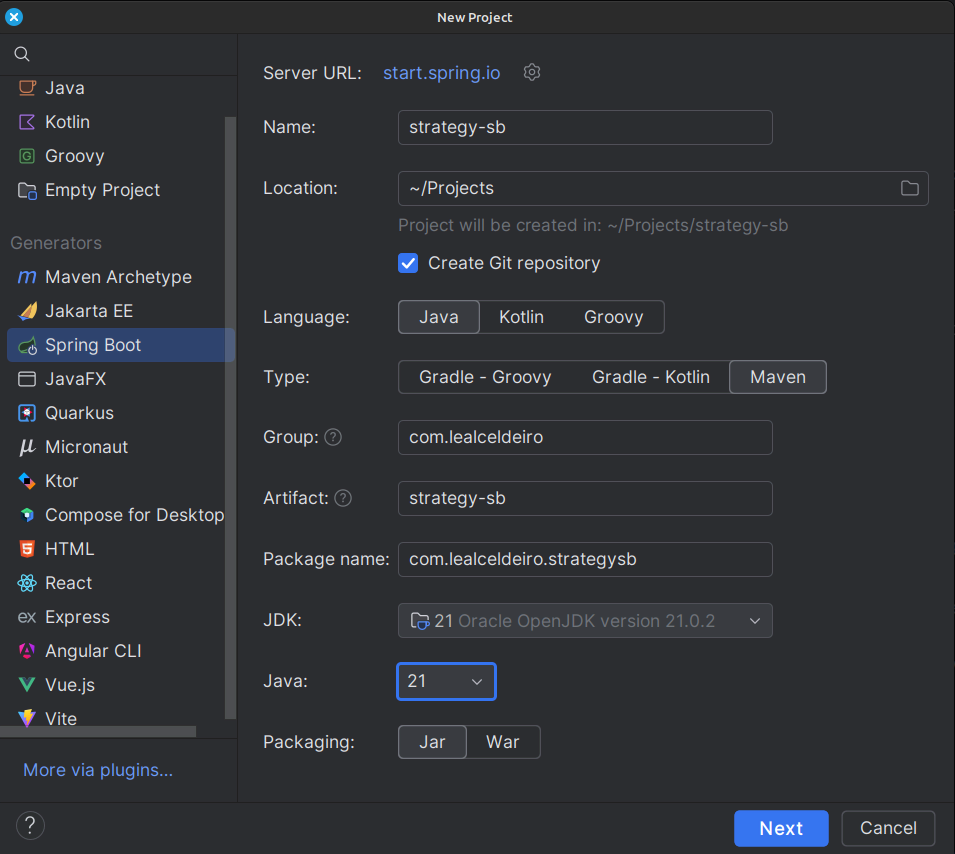
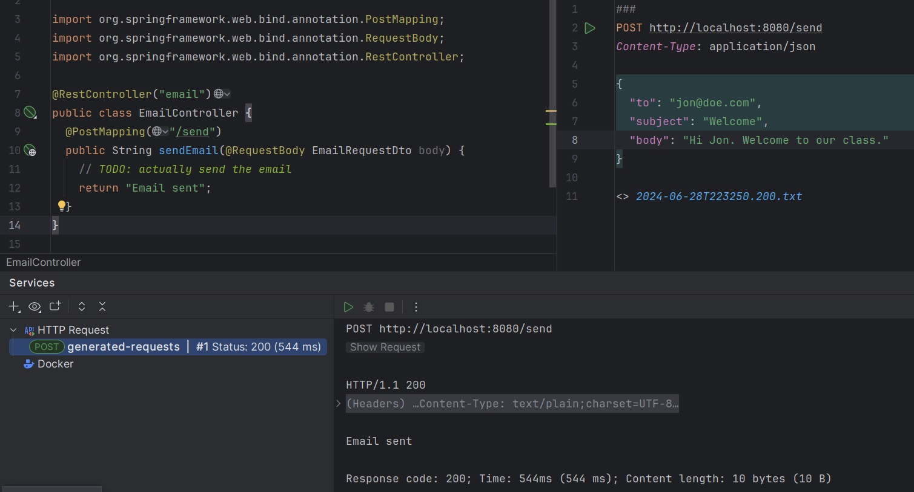

= The strategy pattern in Spring Boot
Asiel Leal_Celdeiro
2024-07-03
:docinfo: shared-footer
:icons: font
:toc-title: In this article
:toc: left
:jbake-document_info: shared-footer
:jbake-table_of_content: left
:jbake-fontawesome: true
:jbake-type: post
:jbake-status: draft
:jbake-tags: java, strategy-pattern, design-pattern, behavioral-pattern, springboot
:jbake-summary: The strategy pattern is one of the well-known software design patterns described in the famous book \
"Design Patterns: Elements of Reusable Object-Oriented Software". Its usage in Spring Boot offers a clean way to \
encapsulate different algorithms and behaviors that makes our applications more maintainable and performant in the \
long term.
:jbake-og_img: articles/2024/images/07/the-strategy_pattern-and-springboot_social.webp
:jbake-image_src: articles/2024/images/07/the-strategy_pattern-and-springboot.webp
:jbake-image_alt: Image of a strategy
:jbake-og_author: Asiel Leal Celdeiro
:jbake-author_handle: lealceldeiro
:jbake-author_profile_image: /img/author/lealceldeiro.webp

The strategy pattern is one of the well-known software design patterns described in the famous book
"Design Patterns: Elements of Reusable Object-Oriented Software".
Its usage in Spring Boot offers a clean way to
encapsulate different algorithms and behaviors that makes our applications
more maintainable and performant in the long term.
In this article we'll explore what this pattern is about and how to use it effectively in Spring Boot.

== The Strategy Pattern

In the words of the renowned authors, the intent of the "Strategy" pattern, also known as "Policy", is to:

[quote,Design Patterns: Elements of Reusable Object-Oriented Software]
____
Define a family of algorithms, encapsulate each one, and make them interchangeable.

Strategy lets the algorithm vary independently from clients that use it.
____

What does this mean exactly?

In simple terms, this means that for a given task, code routine, procedure, any algorithm in general, we can have
several different implementations.
Now, we don't need to expose the _how_ to the clients that consume that algorithm.
Notice, by clients I mean any code that calls the algorithm.

By following this approach, we ensure our logic is not exposed unnecessarily, and we can evolve it without breaking
any client.
This is one of the fundamentals of
link:/articles/2024/java-oop-classes-and-objects.html#what-are-java-classes[Object-Oriented Programming^].

For more details about this pattern, you can check my notes about it in this
https://github.com/lealceldeiro/gems/tree/master/DesignPatternsElementsOfReusableObjectOrientesSoftware/Chapter05/Strategy[GitHub repository],
or you can read it directly from the mentioned book—this is the https://amzn.to/3RIAiAY[Amazon link^].

== What's Spring Boot

It's almost impossible to find a Java developer nowadays who doesn't know what
https://spring.io/projects/spring-boot[Spring Boot^] is.
Nevertheless, I once didn't know what it was either.
So, let's give it a brief intro.

[quote,Spring Boot website]
____
Spring Boot makes it easy to create stand-alone, production-grade Spring based Applications that you can "just run".

We [Spring Boot maintainers] take an opinionated view of the Spring platform and third-party libraries
so you can get started with minimum fuss. Most Spring Boot applications need minimal Spring configuration.
____

That quote is almost impossible to simplify further,
but just to make sure new developers understand it,
let's put it another way:

Spring Boot builds on top of the Spring framework and its ecosystem as well as Java's.
It contains all the capabilities provided by Spring and, on top of that, most of the boilerplate code and configuration
needed to run a traditional Spring application.

This way we can use Spring and many other libraries in our projects without having to worry about
all the XML configuration files and code required to only run the application
(to later on start coding the business logic).
Instead, with Spring Boot, we add its dependencies (Maven, Gradle, etc.), some
https://github.com/spring-projects/spring-boot/blob/main/spring-boot-project/spring-boot-starters/README.adoc[starters^],
as needed, and we're ready to go by focusing on our business logic.

For a more in-depth look at how Spring and Spring Boot work, I'd recommend visiting their official websites
or reading https://amzn.to/3VHWA74[Spring Boot 3 and Spring Framework 6^].

== Some use cases for the Strategy pattern in Spring Boot

It's clear that the strategy pattern has many applications, and it's not the intention of this article to go through
all of them; instead I'll talk about some of the ones I find interesting while using Spring Boot.

To do that, let's take an example scenario, so what we build here makes some sense.

The code repository is at the end of the article, so you can check it out locally.

=== The example scenario

The requirements are as follows:

- Build a simple web endpoint that will accept a
https://developer.mozilla.org/en-US/docs/Web/HTTP/Methods/POST[`POST`^] payload and will email a recipient.
The endpoint will receive in the payload the following attributes.
To keep it simple, there will be no validations or security checks performed and only one recipient can be emailed.
.. `to` (string): recipient's email address
.. `subject` (string): email subject
.. `body` (string): email body
- The application needs to be deployed in different organizations where the internal email provider can be different.
The providers that we'll support are: https://developers.mailersend.com/[Mailersend^],
https://www.twilio.com/en-us/sendgrid/email-api[Twilio^],
https://www.mailgun.com/products/send/email-api/[Mailgun^],
and https://www.mailjet.com/products/email-api/[Mailjet^].

=== Creating the Spring Boot application

==== Project boilerplate
The first thing we need to do is to create the boilerplate for our Spring Boot application.
To do that, we can use many alternatives, being the https://start.spring.io/[Spring initializer] one of the most
commonly used among the community.
Alternatively, if you use https://www.jetbrains.com/idea/[IntelliJ IDEA] Ultimate,
you can also create the project directly from its
https://www.jetbrains.com/help/idea/spring-initializr-project-wizard.html[Spring Boot Project Wizard].
Regardless of which option you choose, the final result should be the same.

Here's what it'd look like from IntelliJ IDEA:

After the project is created, it'll look like this:

image::images/07/spring-boot-app-structure.webp[Spring Boot app project structure, 650, 650]

==== The endpoint implementation
That's all the boilerplate code needed. Now let's focus on our business logic.

The first thing we need to implement is the endpoint that accepts the request with the email information and sends it
to the recipient.

This is going to be as simple as adding the _Spring Boot Web_ starter.
To do it, I'll add the corresponding Maven dependency in the pom.xml file.

[source,xml]
----
  <dependencies>
    <!-- ... -->
    <dependency>
      <groupId>org.springframework.boot</groupId>
      <artifactId>spring-boot-starter-web</artifactId>
    </dependency>
    <!-- ... -->
  </dependencies>
----

Now we're ready to add the controller class. It's as simple as this:

[source,java]
----
@RestController("email")
public class EmailController {
  @PostMapping("/send")
  public String sendEmail(@RequestBody EmailRequestDto body) {
    // TODO: actually send the email
    return "Email sent";
  }
}
----

And when we call the endpoint `email/send` it returns `Email sent`, as you can see in the image below.

But so far, there's no actual email being sent.
It just returns that fancy message.

==== Creating the first email sender component
Up to here this has been straightforward.
Now comes the interesting part.
We need to add a _component_ that does the
actual job of sending the email message.
But we face a challenge here:
one of the requirements says the application must be able to run in different organization
and work with different email providers.

Let's solve the problems one by one. First, let's create the component. `EmailSender`, I'll call it.

[source,java]
----
@Component
public class EmailSender {
  public boolean send(String to, String subject, String body) {
      // TODO: implement
      return false;
  }
}
----

Then we can add it to the controller and update the endpoint logic as follows:

[source,java]
----
@RestController("email")
public class EmailController {
  private final EmailSender emailSender;

  public EmailController(EmailSender emailSender) {
    this.emailSender = emailSender;
  }

  @PostMapping("/send")
  public String sendEmail(@RequestBody EmailRequestDto request) {
    boolean success = emailSender.send(request.to(), request.subject(), request.body());
    return success ? "Email sent" : "Error sending email";
  }
}
----

==== Integrating with the first email provider
Now, let's make it work with one provider: let's say Mailersend.
To do that, we'll follow their
https://github.com/mailersend/mailersend-java?tab=readme-ov-file[documentation^].

We add the new Maven dependency:

[source,xml]
----
<dependency>
  <groupId>com.mailersend</groupId>
  <artifactId>java-sdk</artifactId>
  <version>1.0.0</version>
</dependency>
----

And we update the sender class as follows:

[source, java]
----
@Component
public class EmailSender {
  private static final Logger LOGGER = Logger.getLogger(EmailSender.class.getName());

  @Value("${integration.mailersend.token}")
  private String token;

  public boolean send(String to, String subject, String body) {
    Email email = new Email();
    email.setFrom("Strategy Pattern In Spring Boot", "comlealceldeiro@strategy.com");

    email.addRecipient(to, to);
    email.setSubject(subject);
    email.setPlain(body);

    MailerSend ms = new MailerSend();
    ms.setToken(token);

    try {
      MailerSendResponse response = ms.emails().send(email);
      LOGGER.info("Attempting to send email " + response.messageId);
    } catch (MailerSendException e) {
      LOGGER.warning("Email not sent");
      return false;
    }

    return true;
  }
}
----

Hurray, our first email is on its way!

==== The real challenge

=== Interchangeable beans based on profiles

A https://docs.spring.io/spring-framework/reference/core/beans/definition.html[spring bean^]
is any component we define whose life-cycle is managed by the spring
https://docs.spring.io/spring-framework/reference/core/beans.html#page-title[container^].
One of the most common ways to declare a bean is by using the
https://docs.spring.io/spring-framework/docs/current/javadoc-api/org/springframework/context/annotation/Bean.html[`@Bean`
annotation^].

== GitHub repository

The example code can be found in this
https://github.com/lealceldeiro/com-lealceldeiro-strategy-sb[public GitHub repository].