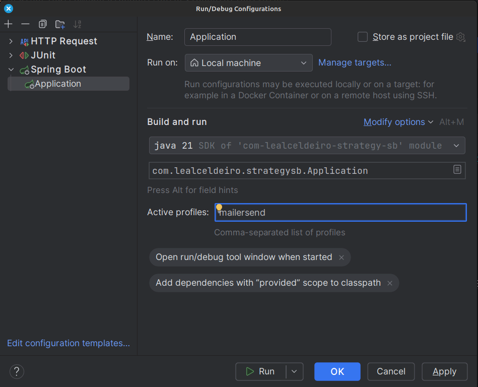

= The strategy pattern in Spring Boot
Asiel Leal_Celdeiro
2024-07-08
:docinfo: shared-footer
:icons: font
:toc-title: In this article
:toc: left
:toclevels: 3
:jbake-document_info: shared-footer
:jbake-table_of_content: left
:jbake-fontawesome: true
:jbake-type: post
:jbake-status: draft
:jbake-tags: java, strategy-pattern, design-pattern, behavioral-pattern, springboot
:jbake-summary: The strategy pattern is one of the well-known software design patterns described in the famous book \
"Design Patterns: Elements of Reusable Object-Oriented Software". Its usage in Spring Boot offers a clean way to \
encapsulate different algorithms and behaviors that makes our applications more maintainable and performant in the \
long term.
:jbake-og_img: articles/2024/images/07/the-strategy_pattern-and-springboot_social.webp
:jbake-image_src: articles/2024/images/07/the-strategy_pattern-and-springboot.webp
:jbake-image_alt: Image of a strategy
:jbake-og_author: Asiel Leal Celdeiro
:jbake-author_handle: lealceldeiro
:jbake-author_profile_image: /img/author/lealceldeiro.webp

The strategy pattern is one of the well-known software design patterns described in the famous book
"Design Patterns: Elements of Reusable Object-Oriented Software".
Its usage in Spring Boot offers a clean way to
encapsulate different algorithms and behaviors that makes our applications
more maintainable and performant in the long term.
In this article we'll explore what this pattern is about and how to use it effectively in Spring Boot.

== The Strategy Pattern

In the words of the renowned authors, the intent of the "Strategy" pattern, also known as "Policy", is to:

[quote,Design Patterns: Elements of Reusable Object-Oriented Software]
____
Define a family of algorithms, encapsulate each one, and make them interchangeable.

Strategy lets the algorithm vary independently from clients that use it.
____

What does this mean exactly?

In simple terms, this means that for a given task, code routine, procedure, any algorithm in general, we can have
several different implementations.
Now, we don't need to expose the _how_ to the clients that consume that algorithm.
Notice, by clients I mean any code that calls the algorithm.

By following this approach, we ensure our logic is not exposed unnecessarily, and we can evolve it without breaking
any client.
This is one of the fundamentals of
link:/articles/2024/java-oop-classes-and-objects.html#what-are-java-classes[Object-Oriented Programming^].

For more details about this pattern, you can check my notes about it in this
https://github.com/lealceldeiro/gems/tree/master/DesignPatternsElementsOfReusableObjectOrientesSoftware/Chapter05/Strategy[GitHub repository],
or you can read it directly from the mentioned book—this is the https://amzn.to/3RIAiAY[Amazon link^].

== What's Spring Boot

It's challenging to find a Java developer nowadays who doesn't know what
https://spring.io/projects/spring-boot[Spring Boot^] is.
Nevertheless, I once didn't know what it was either.
So, let's give it a brief intro.

[quote,Spring Boot website]
____
Spring Boot makes it easy to create stand-alone, production-grade Spring based Applications that you can "just run".

We [Spring Boot maintainers] take an opinionated view of the Spring platform and third-party libraries
so you can get started with minimum fuss. Most Spring Boot applications need minimal Spring configuration.
____

That quote is almost impossible to simplify further,
but just to make sure new developers understand it,
let's put it another way:

Spring Boot builds on top of the Spring framework and its ecosystem as well as Java's.
It contains all the capabilities provided by Spring and, additionally, most of the boilerplate code and configuration
needed to run a traditional Spring application.

This way we can use Spring and many other libraries in our projects without having to worry about
all the XML configuration files and code required to only run the application
(to later on start coding the business logic).
Instead, with Spring Boot, we add its dependencies (Maven, Gradle, etc.), some
https://github.com/spring-projects/spring-boot/blob/main/spring-boot-project/spring-boot-starters/README.adoc[starters^],
as needed, and we're ready to go by focusing on our business logic.

For a more in-depth look at how Spring and Spring Boot work, I'd recommend visiting their official websites
or reading https://amzn.to/3VHWA74[Spring Boot 3 and Spring Framework 6^].

== The Strategy pattern in Spring Boot

It's clear that the strategy pattern has many applications, and it's not the intention of this article to go through
all of them; instead I'll talk about one I find very interesting while using Spring Boot.

To do that, let's take an example scenario, so what we build here makes some sense.

The code repository is at the end of the article, so you can check it out locally.

=== Interchangeable beans

==== The example scenario

The requirements are as follows:

- Build a simple web endpoint that will accept a
https://developer.mozilla.org/en-US/docs/Web/HTTP/Methods/POST[`POST`^] payload and will email a recipient.
The endpoint will receive in the payload the following attributes.
To keep it simple, there will be no validations or security checks performed and only one recipient can be emailed.
.. `to` (string): recipient's email address
.. `subject` (string): email subject
.. `body` (string): email body
- The application needs to be deployed in different organizations where the internal email provider can be different.
The providers that we'll support are: https://developers.mailersend.com/[Mailersend^],
https://www.twilio.com/en-us/sendgrid/email-api[Twilio^],
https://www.mailgun.com/products/send/email-api/[Mailgun^],
and https://www.mailjet.com/products/email-api/[Mailjet^].

==== Creating the application

===== Project boilerplate
The first thing we need to do is to create the boilerplate for our Spring Boot application.
To do that, we can use many alternatives, being the https://start.spring.io/[Spring initializer] one of the most
commonly used among the community.
Alternatively, if you use https://www.jetbrains.com/idea/[IntelliJ IDEA] Ultimate,
you can also create the project directly from its
https://www.jetbrains.com/help/idea/spring-initializr-project-wizard.html[Spring Boot Project Wizard].
Regardless of which option you choose, the final result should be the same.

Here's what it'd look like from IntelliJ IDEA:

image::images/07/spring-boot-idea-project-wizard.webp[IntelliJ IDEA Spring Boot project wizard, 650, 650]

After the project is created, it'll look like this:

image::images/07/spring-boot-app-structure.webp[Spring Boot app project structure, 650, 650]

==== The endpoint implementation
That's all the boilerplate code needed. Now let's focus on our business logic.

The first thing we need to implement is the endpoint that accepts the request with the email information and sends it
to the recipient.

This is going to be as simple as adding the _Spring Boot Web_ starter.
To do it, I'll add the corresponding Maven dependency in the pom.xml file.

[source,xml]
----
  <dependencies>
    <!-- ... -->
    <dependency>
      <groupId>org.springframework.boot</groupId>
      <artifactId>spring-boot-starter-web</artifactId>
    </dependency>
    <!-- ... -->
  </dependencies>
----

Now we're ready to add the controller class. It's as simple as this:

[source,java]
----
@RestController("email")
public class EmailController {
  @PostMapping("/send")
  public String sendEmail(@RequestBody EmailRequestDto body) {
    // TODO: actually send the email
    return "Email sent";
  }
}
----

And when we call the endpoint `email/send` it returns `Email sent`, as you can see in the image below.

image::images/07/spring-boot-controller-endpoint.webp[Rest Controller, 850, 750]

But so far, there's no actual email being sent.
It just returns that fancy message.

==== The first email sender
Up to here this has been straightforward.
Now comes the interesting part.
We need to add a _component_ that does the
actual job of sending the email message.

Let's solve the problems one by one. First, let's create the component. `EmailSender`, I'll call it.

[source,java]
----
@Component
public class EmailSender {
  public boolean send(String to, String subject, String body) {
      // TODO: implement
      return false;
  }
}
----

Then we can add it to the controller and update the endpoint logic as follows:

[source,java]
----
@RestController("email")
public class EmailController {
  private final EmailSender emailSender;

  public EmailController(EmailSender emailSender) {
    this.emailSender = emailSender;
  }

  @PostMapping("/send")
  public String sendEmail(@RequestBody EmailRequestDto request) {
    boolean success = emailSender.send(request.to(), request.subject(), request.body());
    return success ? "Email sent" : "Error sending email";
  }
}
----

==== Integrating with the first email provider
Now, let's make it work with one provider: let's say Mailersend.
To do that, we'll follow their
https://github.com/mailersend/mailersend-java?tab=readme-ov-file[documentation^].

We add the new Maven dependency:

[source,xml]
----
<dependency>
  <groupId>com.mailersend</groupId>
  <artifactId>java-sdk</artifactId>
  <version>1.0.0</version>
</dependency>
----

And we update the sender class as follows:

[source, java]
----
@Component
public class EmailSender {
  private static final Logger LOGGER = Logger.getLogger(EmailSender.class.getName());

  @Value("${integration.mailersend.token}")
  private String token;

  public boolean send(String to, String subject, String body) {
    Email email = createEmail(to, subject, body);
    MailerSend sender = createSender();

    return sendEmailUsingSender(sender, email);
  }

  private static Email createEmail(String to, String subject, String body) {
    Email email = new Email();
    email.setFrom("Strategy Pattern In Spring Boot", "comlealceldeiro@strategy.com");

    email.addRecipient(to, to);
    email.setSubject(subject);
    email.setPlain(body);
    return email;
  }

  private MailerSend createSender() {
    MailerSend ms = new MailerSend();
    ms.setToken(token);
    return ms;
  }

  private static boolean sendEmailUsingSender(MailerSend sender, Email email) {
    LOGGER.info("Attempting to send email ");
    try {
      MailerSendResponse response = sender.emails().send(email);
      LOGGER.info("Sent email with id " + response.messageId);
    } catch (MailerSendException e) {
      LOGGER.warning("Email not sent");
      return false;
    }

    return true;
  }
}
----

Notice how we added the field `token` to be bound to the Spring Boot property `integration.mailersend.token`.
This property can be set in the `application.properties` (or yml) file as follows:

[source,properties]
----
integration.mailersend.token=eyJhbGciOiJIUzI1NiIsInR0Q8AOZ6RWm_rqbj9tYr8-J4
----

[TIP]
====
In an actual production code, it's safer to set the token through the cloud provider cli or secrets configuration.
But it's never safe to store it in plain text, except (maybe) for local development.
====

Hurray, our first email is on its way!

==== The real challenge

But we face a challenge here:
one of the requirements says the application must be able to run in different organization
and work with different email providers, but if this application is deployed in an environment where the email
provider is different from Mailersend, it'll fail.

The most "simple" solution anyone, with the most basic knowledge of Spring Boot, could think of,
is to add a "flag property" in the `application.properties` corresponding to each environment.
Then depending on the value of that variable at runtime&mdash;which will be different in each environment&mdash;,
we would use a different logic inside our `EmailSender#send` to connect to a different
email API provider.
That's it, through some `if`/`swtich` checks or similar.
Some other alternatives along these lines would work too.

That's not an incorrect solution.
However, in the long term, it'll become harder to maintain as the class grows bigger over time and new
provider integrations are added.
It'll get to the point that it'll hinder the development itself.

A better solution would be creating a different `EmailSender` component for each integration we want to support,
and "load the correct one" at deployment time instead of having a fixed instance in `EmailController`.

==== Spring profiles to the rescue

Spring https://docs.spring.io/spring-boot/reference/features/profiles.html[profiles^] provide a way for us
to segregate parts of an application configuration and make it be available only in certain environment(s).

This feature,
together with configuration components
and spring beans,
is a powerful tool at our disposal here.

[NOTE]
====
A https://docs.spring.io/spring-framework/reference/core/beans/definition.html[spring bean^]
is any component we define whose life-cycle is managed by the spring
https://docs.spring.io/spring-framework/reference/core/beans.html#page-title[container^].
One of the most common ways to declare a bean is by using the
https://docs.spring.io/spring-framework/docs/current/javadoc-api/org/springframework/context/annotation/Bean.html[`@Bean`
annotation^].

Scoping a component to a specific profile is usually done by using the `@Profiles` annotation on the component.
====

So, we're going to use this feature to have one bean per strategy.
Each strategy will correspond to the logic to send the email to each email provider.
Then, when the application is deployed in a given environment,
the bean (Java class component)
with the strategy that corresponds to the integration for that environment
will be https://docs.spring.io/spring-framework/reference/core/beans/annotation-config/autowired.html[wired^],
that is it https://docs.spring.io/spring-framework/reference/core/beans/dependencies/factory-collaborators.html[injected^],
into the component that requires it.

===== Support to all providers

Let's code it.

First, we need to find a way to keep a single dependency in our controller.
We don't want to declare one dependency per strategy.
To achieve this, we'll use an interface: `EmailSender` (we'll rename the class with that name, don't worry).

[source,java]
----
public interface EmailSender {
  boolean send(String to, String subject, String body);
}
----

Next, let's update our previous `EmailSender` class. We'll make it implement `EmailSender`
and override the `send` method.
The rest of the code stays the same.

[source,java]
----
@Component
public class MailerSendEmailSender implements EmailSender {
  // ... rest of the code unchanged

  @Override
  public boolean send(String to, String subject, String body) {
    // ... rest of the code unchanged
  }
}
----

By doing this, Spring Boot we'll manage the dependency injection for us automatically.
That is, at runtime it will locate a bean that implements `EmailSender`
and inject it in the `EmailController` class.

So far this has been a code refactor, we're still not giving support to other providers.

Let's implement the rest of them—I'll leave the details out, but the gist should be clear from this example.

Twilio.

[source,java]
----
@Component
public class TwilioEmailSender implements EmailSender {

  @Override
  public boolean send(String to, String subject, String body) {
    // ... logic to send emails through the Twilio API
  }
}
----

Mailgun.

[source,java]
----
@Component
public class MailgunEmailSender implements EmailSender {

  @Override
  public boolean send(String to, String subject, String body) {
    // ... logic to send emails through the Mailgun API
  }
}
----

Mailjet.

[source,java]
----
@Component
public class MailjetEmailSender implements EmailSender {

  @Override
  public boolean send(String to, String subject, String body) {
    // ... logic to send emails through the Mailjet API
  }
}
----

At this point, if we try to run the application, we'll get an error like this one:

[source,console]
----
Parameter 0 of constructor in com.lealceldeiro.strategysb.EmailController required a single bean, but 4 were found:
	- mailerSendEmailSender: defined in file [~/MailerSendEmailSender.class]
	- mailgunEmailSender: defined in file [~/MailgunEmailSender.class]
	- mailjetEmailSender: defined in file [~/MailjetEmailSender.class]
	- twilioEmailSender: defined in file [~/TwilioEmailSender.class]

This may be due to missing parameter name information

Action:

Consider marking one of the beans as @Primary, updating the consumer to accept multiple beans, or using @Qualifier to identify the bean that should be consumed
----

The framework message is pretty clear: we're asking for one bean in `EmailController` but Spring found 4!

The options to fix this are also available in the message itself:

- Define one of the beans as __primary__: annotate one of the implementations as `@Primary`
- Accept multiple beans in the controller instead of one:
in the controller, receive in the constructor the argument as
`List<EmailSender> senders` instead of `EmailSender emailSender`
- Use `@Qualifier` in the controller constructor argument: i.e.: `@Qualifier("mailerSendEmailSender") EmailSender emailSender`

When we face this situation, we must always evaluate what our use case is and what option makes the most sense.
For example, for this particular case using `@Primary` for one of the providers would be enough.

However, remember that our primary goal here was to have one bean/component or the other based on the environment
the application is running on.
This gives us another option to "fix" the previous error and, at the same time,
give a solution to our initial requirement.
We'll declare for each component for which profile they'll be available.

To do this, we'll use the mentioned
https://docs.spring.io/spring-framework/docs/current/javadoc-api/org/springframework/context/annotation/Profile.html[`@Profile`^]
annotation.

Mailersend.

[source,java]
----
@Profile("mailersend")
@Component
public class MailerSendEmailSender implements EmailSender {
  // ...
}
----

Twilio.

[source,java]
----
@Profile("twilio")
@Component
public class TwilioEmailSender implements EmailSender {
  // ...
}
----

Mailgun.

[source,java]
----
@Profile("mailgun")
@Component
public class MailgunEmailSender implements EmailSender {
  // ...
}
----

Mailjet.

[source,java]
----
@Profile("mailjet")
@Component
public class MailjetEmailSender implements EmailSender {
  // ...
}
----

Have in mind that now, we must specify a profile for our application to start,
otherwise Spring won't find the correct bean associated with the profile and will fail.

From IntelliJ IDEA, you can do it from the
https://www.jetbrains.com/help/idea/run-debug-configuration-spring-boot.html[Spring Boot Run Configuration^],
like this:

That's it for this use case.

For experienced Spring Boot developers, this might look like a trivial example.
But when we implement something like this out of many years of practice,
how many times do we stop and think for a second we're using the "Strategy" pattern?
Sometimes it's useful to do it ;)

=== Other applications

What's shown in the previous example is just that: ONE example.
The number of use cases where we can apply it is humongous:
in integration with third party services, sorting algorithms, notification services, file compression,
authentication mechanisms, and much more.

=== Strategy in Spring Boot itself

Aside from using this pattern in our applications to fulfil specific use cases, it's also widely used
in many frameworks, including Spring Boot.

For example, https://spring.io/projects/spring-data[Spring Data^]
provides a flexible way to interact with databases.
Depending on the application's requirements, different data access strategies can be used,
such as JDBC, JPA, or any other of the many available.

== GitHub repository

The example code posted in this article can be found in this
https://github.com/lealceldeiro/com-lealceldeiro-strategy-sb[public GitHub repository].